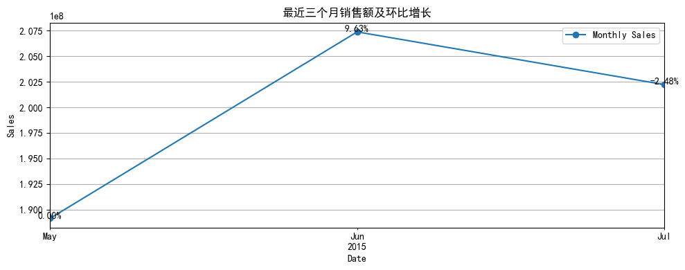
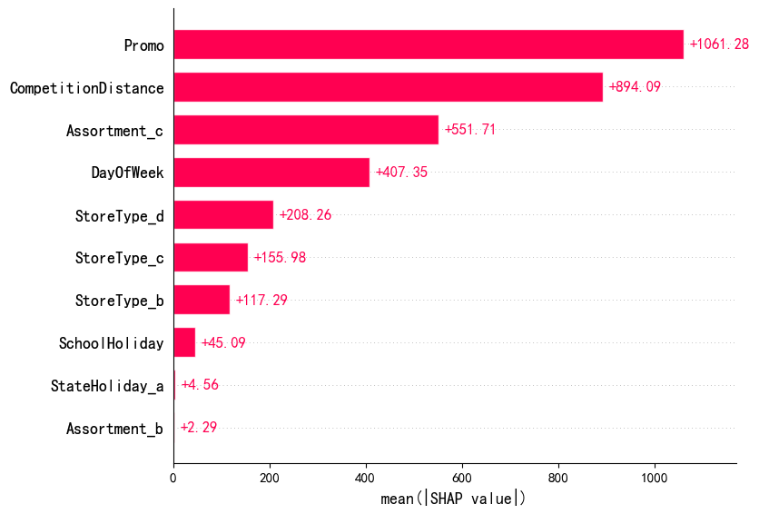
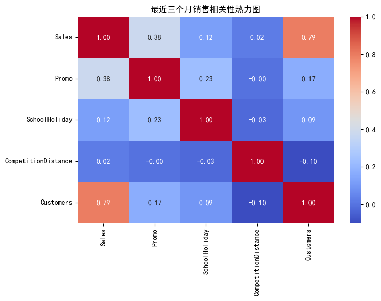
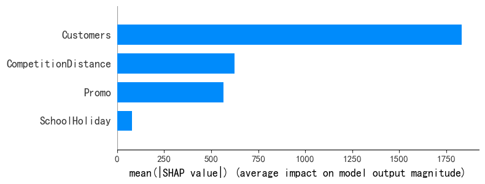

# Rossmann 营业额异常归因分析报告

## 📌 一、项目背景

- **项目地址**：[Rossmann Store Sales - Kaggle](https://www.kaggle.com/c/rossmann-store-sales)
- **目标**：不是做预测，而是针对 `train.csv` 数据中的最近三个月（2015年7月~9月）进行 **营业额环比异常归因分析**
- **方法**：使用 XGBoost 模型结合 SHAP 分析工具，解释影响营业额变化的主要驱动因素及其贡献度

---

### 1. 数据准备
- 合并 `train.csv` 和 `store.csv`
- 保留营业中的数据（Open == 1 且 Sales > 0）
- 选取时间范围：`2015-05-01` ~ `2015-07-30`


```python
import pandas as pd
import numpy as np
import matplotlib.pyplot as plt
import seaborn as sns

# 读取数据
df_train = pd.read_csv('C:/Users/95680/Desktop/train.csv', low_memory=False, dtype={'StateHoliday': str})
df_store = pd.read_csv('C:/Users/95680/Desktop/store.csv')

# 合并
df = pd.merge(df_train, df_store, on='Store')
df['Date'] = pd.to_datetime(df['Date'])

# 只保留营业状态为开的数据
df = df[df['Open'] == 1]
df = df[df['Sales'] > 0]
```


```python
df['YearMonth'] = df['Date'].dt.to_period("M")
print(df['YearMonth'].value_counts().sort_index())
```

    YearMonth
    2013-01    28865
    2013-02    26682
    2013-03    27891
    2013-04    27878
    2013-05    26199
    2013-06    27939
    2013-07    30164
    2013-08    30023
    2013-09    27980
    2013-10    28990
    2013-11    28412
    2013-12    26901
    2014-01    28707
    2014-02    26791
    2014-03    29005
    2014-04    26917
    2014-05    28021
    2014-06    26209
    2014-07    25224
    2014-08    24388
    2014-09    24341
    2014-10    24301
    2014-11    22989
    2014-12    23492
    2015-01    28763
    2015-02    26766
    2015-03    29079
    2015-04    26931
    2015-05    25879
    2015-06    28423
    2015-07    30188
    Freq: M, Name: count, dtype: int64
    

可以看到，最近三个月未2015-05到2015-07，我们选择这三个月作为分析的对象

### 2. 销售趋势与环比变化
- 每月营业额趋势可视化
- 计算环比增长百分比


```python
import matplotlib.pyplot as plt
plt.rcParams['font.family'] = 'SimHei'
plt.rcParams['axes.unicode_minus'] = False

# 查看时间范围
print("数据时间范围：", df['Date'].min(), "到", df['Date'].max())

# 选取最近三个月
recent_df = df[(df['Date'] >= '2015-05-01') & (df['Date'] <= '2015-07-30')]
print("最近三个月数据量：", recent_df.shape)

# 按月销售额
monthly_sales = recent_df.groupby(recent_df['Date'].dt.to_period("M"))['Sales'].sum()
monthly_sales = monthly_sales.to_timestamp()
print("每月销售额：\n", monthly_sales)

# 环比变化
monthly_pct_change = monthly_sales.pct_change().fillna(0)

# 可视化
fig, ax = plt.subplots(figsize=(10, 4))
monthly_sales.plot(marker='o', ax=ax, label='Monthly Sales')
for i in range(len(monthly_sales)):
    ax.text(monthly_sales.index[i], monthly_sales[i] + 20000, f"{monthly_pct_change[i]*100:.2f}%", ha='center')
ax.set_title("最近三个月销售额及环比增长")
ax.set_ylabel("Sales")
plt.grid()
plt.legend()
plt.tight_layout()
plt.show()
```

    数据时间范围： 2013-01-01 00:00:00 到 2015-07-31 00:00:00
    最近三个月数据量： (83377, 19)
    每月销售额：
     Date
    2015-05-01    189143897
    2015-06-01    207363373
    2015-07-01    202212874
    Freq: MS, Name: Sales, dtype: int64
    


    

    


### 3. 构建归因模型
- 特征选择：如 `Promo`, `SchoolHoliday`, `StoreType`, `Assortment`, `CompetitionDistance` 等
- 使用 XGBoost 拟合 Sales
- 借助 SHAP 解释模型预测并进行归因分析


```python
import xgboost as xgb
import shap

# 选取相关特征
features = ['Promo', 'SchoolHoliday', 'StateHoliday', 'StoreType', 
            'Assortment', 'CompetitionDistance', 'DayOfWeek']
df_model = recent_df[features + ['Sales']].copy()

# 编码类别变量
df_model = pd.get_dummies(df_model, columns=['StateHoliday', 'StoreType', 'Assortment'], drop_first=True)

# 特征 & 目标
X = df_model.drop(columns='Sales')
y = df_model['Sales']

# 拟合模型
model = xgb.XGBRegressor(n_estimators=100, random_state=42)
model.fit(X, y)

# SHAP 分析
explainer = shap.Explainer(model)
shap_values = explainer(X)

# 可视化：SHAP 平均影响力（归因）
shap.plots.bar(shap_values, max_display=10)

```


    

    


特征	SHAP值	业务解释
Promo	+1061.28	促销活动对销售额提升作用最显著，平均贡献值最高，说明促销策略有效性极佳
CompetitionDistance	+894.09	竞争店铺距离越远，销售额越高（可能与周边客源垄断或竞争压力减小相关）
Assortment_c	+551.71	商品分类c（可能为高端或特色商品组合）对销售额有强正向影响
DayOfWeek	+407.35	周内某几天（如周末）的销售表现显著优于其他日期
StoreType_d	+208.26	店铺类型d（可能为交通枢纽店或大型商场店）的销售优势明显


分析结果：
1. 竞争距离的正向影响

反常现象：通常竞争距离越近，销售额可能因分流而下降，但此处显示竞争距离越远贡献度越。

可因：

数据中竞争距离缺失值较多（需检查CompetitionDistanc的缺失率）

店铺选址策略特殊（如偏地区垄断性强）

竞争店铺的存在反而带来集聚效应（2. 需结合业务验证

商品分类的差异

Assortment_c贡献度显著高于Assortment_b（+551.71s +2.29），说明：
，
商品组合c更符合消费者
需3. 

分类b可能要优化或淘汰

店铺类型的层级效应

StreType贡献度排序：d > c > b

反映不同店铺类型的市场竞争力差异，建议优先扩展d类店铺

业务建议：
1. 促销策略优化
增加促销频率，尤其是对高贡献店铺类型（d类）和商品分类（c类）
分析促销活动的边际收益，避免过度依赖促销
2. 竞争距离的深入分析
检查CompetitionDistance数据质量（缺失值、异常值）
结合地理信息数据，研究竞争店铺分布与销售额的关系
3. 商品组合调整
扩大Assortment_c的商品覆盖范围
评估Assortment_b的留存必要性
4. 店铺类型优先级
资源向StoreType_d倾斜（如选址、库存、营销）
分析StoreType_c与b的运营差异，制定改进方案


```python
# 分组查看变量平均值按月份对比
recent_df['Month'] = recent_df['Date'].dt.to_period("M").astype(str)
summary_table = recent_df.groupby('Month')[['Promo', 'SchoolHoliday', 'CompetitionDistance']].mean()
print(summary_table)
```

                Promo  SchoolHoliday  CompetitionDistance
    Month                                                
    2015-05  0.431354       0.085011          5470.693917
    2015-06  0.446505       0.055835          5463.992098
    2015-07  0.459433       0.405813          5435.897507
    

    
    A value is trying to be set on a copy of a slice from a DataFrame.
    Try using .loc[row_indexer,col_indexer] = value instead
    
    See the caveats in the documentation: https://pandas.pydata.org/pandas-docs/stable/user_guide/indexing.html#returning-a-view-versus-a-copy
    

ai分析
提示词：分析结果、对每个数据进行分析探讨
✅ Promo 列（促销活动）
表示该月参与促销的门店占比：

5月：43.1% 的门店有促销

6月：44.7%

7月：45.9%

趋势：略微上升，可能带来销售增长。
✅ SchoolHoliday 列（学校假期）
表示该月有学校假期的天数比例或门店占比：

5月：仅 8.5%

6月：5.6%

7月：40.6%

趋势：7月大幅上升，说明7月进入暑假，家庭出行/购物可能增加，对销售是一个积极影响。
✅ CompetitionDistance 列（竞争对手距离）
数值越高说明竞争对手越远，理论上对自己越有利。

稍有下降，从 5470 米降到 5436 米，影响不大，变化幅度很小。
7月销售额增加（假设你之前图里看到的确是增加），可能由以下几方面推动：

✅ 促销活动略增加（促销门店从 43.1% → 45.9%）

✅ 暑假来临，SchoolHoliday 占比暴增至 40%+

⚠️ 竞争环境变化不显著（可以暂时忽略）


```python
import seaborn as sns
import matplotlib.pyplot as plt

# 选取 7~9 月数据
recent_df = df[(df['Date'] >= '2015-07-01') & (df['Date'] <= '2015-09-30')]

# 选取用于归因分析的字段
corr_df = recent_df[['Sales', 'Promo', 'SchoolHoliday', 'CompetitionDistance', 'Customers']]

# 计算相关系数
corr = corr_df.corr()

# 可视化
plt.figure(figsize=(8, 6))
sns.heatmap(corr, annot=True, fmt=".2f", cmap='coolwarm')
plt.title("最近三个月销售相关性热力图")
plt.tight_layout()
plt.show()
```


    

    


上述相关热力图来看，近三个月Customers数量对销售额的影响是最大达到，其次是促销活动。学校假期，竞争对手距离的影响几乎可以忽略不记，
说明应该从顾客数量和促销活动去进行策划，以增加销售额


```python
import xgboost as xgb
import shap

# 特征工程
features = ['Promo', 'SchoolHoliday', 'CompetitionDistance', 'Customers']
X = recent_df[features]
y = recent_df['Sales']

# 训练 XGBoost 模型
model = xgb.XGBRegressor(n_estimators=100, random_state=42)
model.fit(X, y)

# 使用 SHAP 进行归因分析
explainer = shap.Explainer(model)
shap_values = explainer(X)

# 可视化重要性
shap.summary_plot(shap_values, X, plot_type="bar")

```


    

    


从归因分析结果来看，近三个月顾客数量对销售额的影响是最大的，其次是竞争对手距离，说明从简单的相关分析来看会忽略一些信息，学校假期对模型的影响可以忽略不记
总之，应该重视Customers数量，改善促销活动手段。
